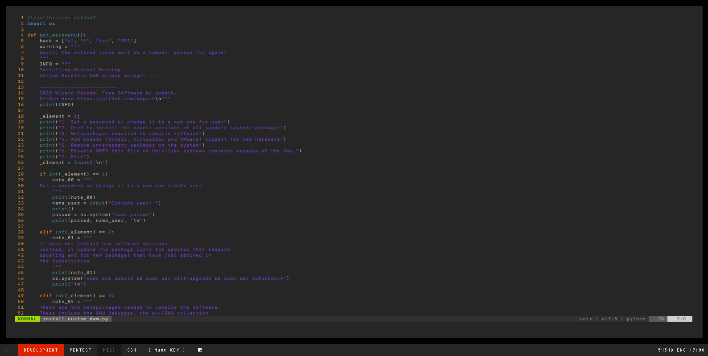

A simplified view of installing a window manager.

Note: decided to write a simple script (in Python3) to install the window manager DWM.

[CustomDWM](https://github.com/appath/CustomDWM)
Install package: [CustomDWM Package Ubuntu Linux](https://github.com/appath/CustomDWM/releases)
topic author: appath

How it will look like (screenshot/screenshot_25.05.2021.png):

